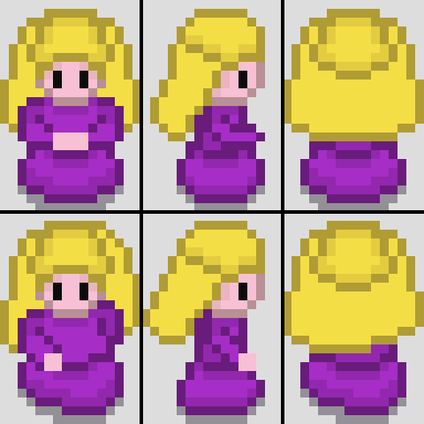

# res2gba
Convert resources listed in the specified files into GBA-readable
formats for easy embedding into ROMs.

## Purpose
Resources, such as images and audio files, need to be converted before
being embedded into a *Game Boy Advance* ROM, since the console expects
data to be formatted in certain ways. This program takes care of that.

## Installation
Make sure that Python 3 is installed. After that, you can clone this
repository:
```sh
git clone https://github.com/Vulcalien/res2gba.git
```

Another approach is to add it as a git submodule in your project:
```sh
git submodule add https://github.com/Vulcalien/res2gba.git tools/res2gba
```

## Usage
*res2gba* uses `.json` or `.toml` files to list the resources to
convert and their properties. Here is an example of a list file:

```json
{
    "input_dir": "res",
    "output_dir": "src/res",

    "tilesets": [
        {
            "name": "tileset",
            "input": "img/tileset.png",
            "output": "tileset.c",
            "static": true,

            "tile_size": 2,
            "palette": "res/img/palette.png",
            "colors": { "#ff00ff": 0 },
            "bpp": 4
        }, {
            "name": "spritesheet",
            "input": "img/spritesheet.png",
            "output": "spritesheet.c",
            "static": true,

            "tile_size": [ 2, 3 ],
            "palette": "res/img/palette.png",
            "colors": { "#ff00ff": 0 },
            "bpp": 4
        }
    ],
    "palettes": [
        {
            "name": "palette",
            "input": "img/palette.png",
            "output": "palette.c"
        }
    ]
}
```

This file lists two tilesets and one palette, indicating for each of
them their name, input and output paths, and other properties specific
to the respective resource type. To convert resources listed in
`example.json`, run this:

```sh
<path-to-program>/res2gba example.json
```

### Resource types
The program can convert these types of resource: *tilesets*, *images*,
*palettes* and *files*.

*Tilesets* are images composed of tiles of a given size, which are then
divided in 8x8 blocks. This type of resource matches the GBA's way of
dealing with tiled backgrounds or sprites. For example, this is a
tileset (black lines drawn on top to highlight tiles):



*Images* are generic images, treated as simple arrays of pixels.

*Palettes* are images treated as lists of colors. Since the GBA uses
indexed colors (except in some display modes), *res2gba* needs palettes
to properly map pixels of tilesets and images. The following palette
works well for the tileset shown above:


*Files* are generic files, prepared for embedding without changing their
format. These may contain text, raw audio, level files... To embed audio
files, first convert them into **uncompressed signed 8-bit PCM** with
the desired frequency (e.g. 16384 Hz). For example, using `ffmpeg`:
```sh
ffmpeg -i input.wav -ac 1 -ar 16384 -f s8 output.raw
```

### Output files
*res2gba* converts input files into C source files containing an array
of uncompressed data, which can be compiled or included into other code.
For example, the palette above would be converted into this code:
```c
typedef unsigned short u16;
const u16 example_palette[12] = {
    0x6f7b,0x0421,0x4a52,0x1a76,0x233c,0x237e,
    0x3c6d,0x54b2,0x60b4,0x4a57,0x62dd,0x6b1f,
};
```

### Documentation
For more details on this program, such as the meaning of each property,
[read the manual](doc/res2gba.adoc).

## Contributing
If you find an issue in the program, or some detail about its usage is
not clear to you, 
[open an issue](https://github.com/Vulcalien/res2gba/issues).

## Licence
*res2gba* is released under the GNU General Public License, either
version 3 of the License or any later version.
